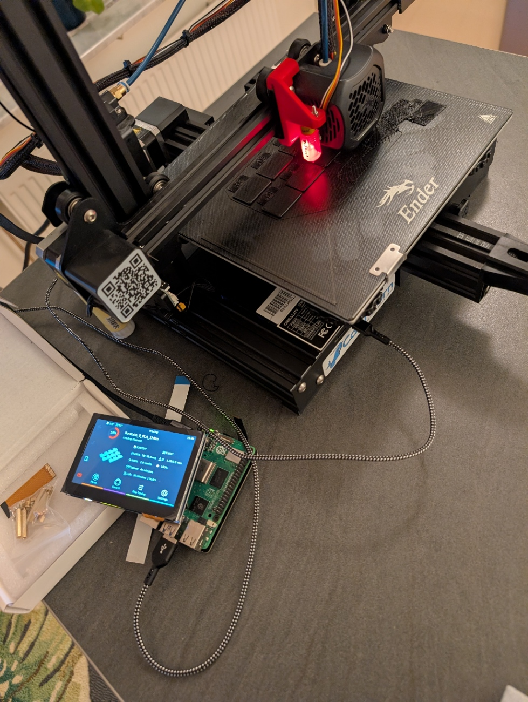

# Ender3 V2
Repo to track config and files for sensible opinionated defaults for running klipper and mainsail.

Never mind the failed print...


Some repos and inspiration:
- https://github.com/Klipper3d/klipper/blob/master/config/printer-creality-ender3-v2-2020.cfg
- https://docs-os.mainsail.xyz/
- https://github.com/SoftFever/OrcaSlicer

Operations guide for setup:
https://github.com/BenD780x9/Klipper-for-Ender_3_v2

## Starter/"Free" Hardware:
- RPI -> Flash mainsail OS with rpi imager
- Ender3 V2
  - 0.4mm brass tips
  - capricorn PTFE upgrade
- BLTouch probe 3.1


## Bought Hardware
- Waveshare 4.3" ~490sek ([or other supported by KlipperScreen](https://klipperscreen.readthedocs.io/en/latest/Hardware/))

## TODOs
- Mount RPI and Screen
  - https://www.printables.com/model/419809-side-holder-for-waveshare-43-raspberry-pi-case
  - https://www.printables.com/model/189275-raspberry-pi-case-for-waveshare-43-inch-dsi-lcd-mo
- Get quieter fans. (~200sek each)
- Consider hotend upgrade to all-in-one with direct drive.
- PTFE tube with mounts from bowden extruder to closer to the spool.

## FAQ

#### 1. Ender3-v2 - no screen, no wifi - How do i interact with it?
Say you get a printer with no screen, no wifi, and no obvious controll mechanics- what do you do?

One can interact with the printer over serial using something like [pronterface)(https://www.pronterface.com/) this
can turn something like any generic laptop into a screen for the printer.

One can set up an rpi with wifi and connect that either via octoprint/merlin or klipper.

These supposedly shipped with rpi like devices - buy a used one?

#### 2. I got a 3d printer with no history or screen how do i know whats what?

Something like pronterface will let you run basic g-code with the printer. This should allow you to run gcode command
`M115` see https://marlinfw.org/docs/gcode/M115.html
This will tell you what firmware is setup on the printer itself.
This should output something like the following if klipper is installed.
```
FIRMWARE_NAME:Klipper FIRMWARE_VERSION:v0.13.0-374-g99c0bfca4
```
Klipper and marlin are mutually exclusive.

#### 3. I want to install klipper!

The klipper binaries are easily built from a RPI running mainsail os.
Instructions here- https://github.com/BenD780x9/Klipper-for-Ender_3_v2?tab=readme-ov-file#basic-installation

#### 4. How do i calibrate the funky screw thingies on the printbed? / How do level my bed?

With BlTouch the easiest way imo. is to use the mainsail interface. Click calibrate under the toolhead settings.
With a console refer to - https://www.klipper3d.org/Probe_Calibrate.html
There is an old manual way involving paper which is relevant if you dont have the BlTouch sensor.

#### 5. Wierd stuff happening to extrude rates.

The rotation distance appears correct out of the box however for the default klipper config for the printer indicating
the current extruder is the factory default one. However testing this with the following formula proved an interesting
journey.
```
G91 ; Set to relative positioning
G1 E50 F60 ; Extrude 50mm of filament at 1mm/s (slow and accurate)
M109 S0 ; Set cold
```
This expects the printer to eat 5cm of filament at the input side. Put a marker well before this say at 7cm away from
the extruder input and mark this. Run the code above. Measure the filament eaten. This is the <actual_extrude_distance>.
`rotation_distance = <previous_rotation_distance> * <actual_extrude_distance> / <requested_extrude_distance>`
See https://www.klipper3d.org/Rotation_Distance.html.